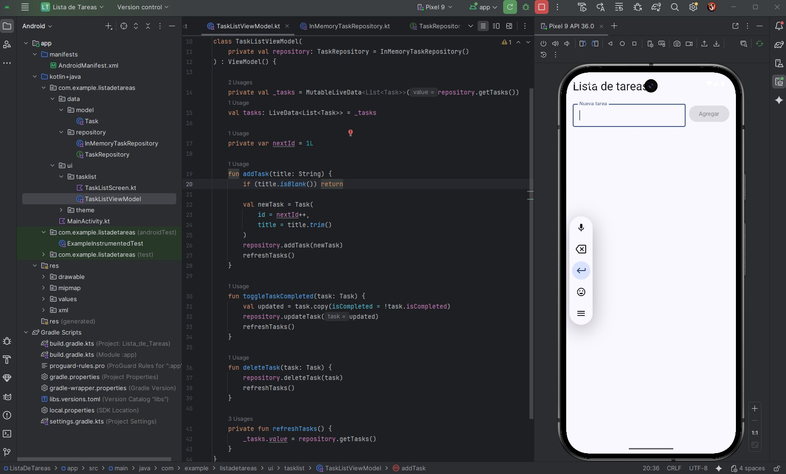
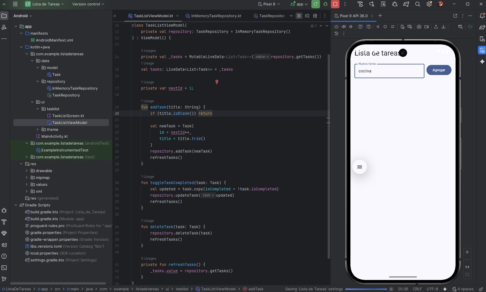
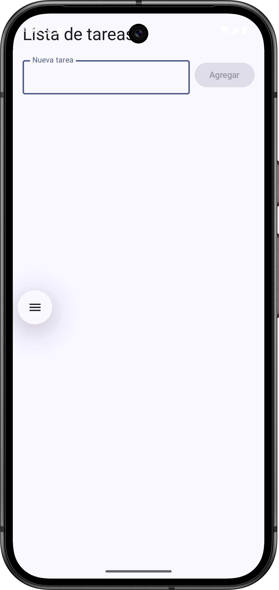
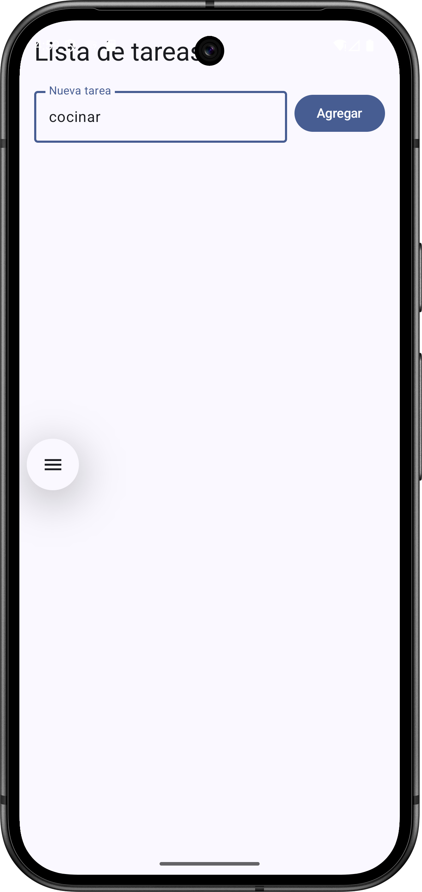
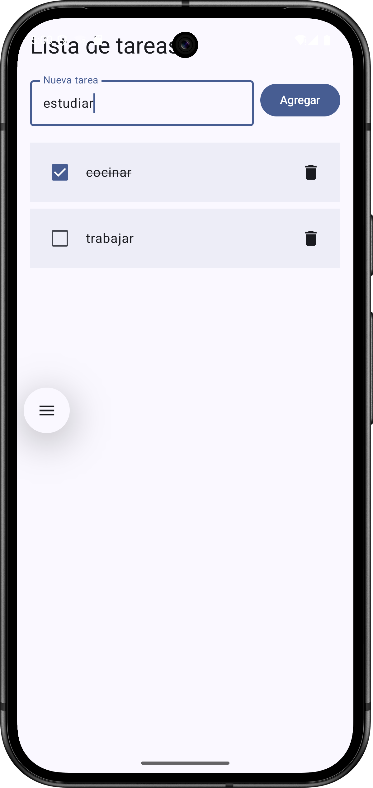
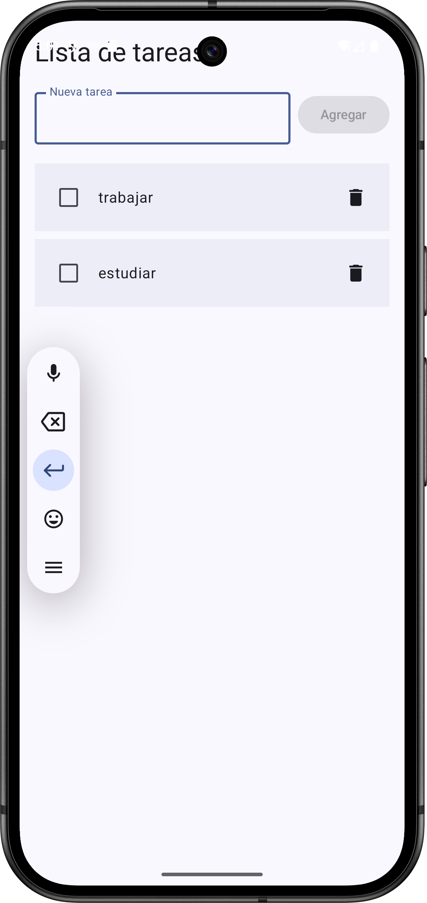

**_<h1 align="center">:vulcan_salute: Proyecto Realizado con Andoid Studio :computer:</h1>_**

**<h3>:blue_book: Contexto:</h3>**

<p>Un cliente quiere una aplicación de lista de tareas donde los usuarios puedan:</p>
<ul>
    <li>Agregar tareas</li>
    <li>Marcar tareas como completadas</li>
    <li>Eliminar tareas</li>
</ul>
<p>Pero el cliente es claro: la app debe ser escalable y mantenible, ya que más adelante se integrarán notificaciones y almacenamiento en la nube.</p>
<p>Te piden usar buenas prácticas de arquitectura.</p>
<p>La empresa te asigna la responsabilidad de proponer el patrón arquitectónico más adecuado y desarrollar un módulo funcional que demuestre la correcta separación de responsabilidades.</p>

**<h3>:orange_book: Requerimiento:</h3>**

1. [Investigar y explicar brevemente qué son los patrones de diseño y por qué usar MVVM en Android.](./PREGUNTAS.md)
2. Construir una pequeña app Android aplicando el patrón MVVM, utilizando:

<ul>
    <li>ViewModel para manejar la lógica de negocio</li>
    <li>LiveData para observar cambios y actualizar la UI</li>
    <li>Jetpack Components (ViewModel, LiveData)</li>

</ul>

3. [Demostrar el funcionamiento de observadores y explicar cómo mejora la escalabilidad.](./PREGUNTAS.md)
4. [Preparar la estructura del proyecto pensando en la posibilidad de agregar nuevas funciones (por ejemplo, base de datos o consumo de API).](./README.md)

**<h3>📁 Estructura del Proyecto Android:</h3>**

```Android
📘 README.md
📘 PREGUNTAS.md
📁 app/src/main/
├── 🟧 AndroidManifest.xml
├── 📁 java
│   ├── 📁 com.example.listadetareas
│   │   ├── 📁 data
│   │   │    ├── 🟦 Plant.kt
│   │   │    └── 🟦 PlantsRepository.kt
│   │   ├── 📁 ui
│   │   │   ├──📁 tasklist
│   │   │   │    ├── 🟦 TaskListScreen.kt
│   │   │   │    └── 🟦 TaskListViewModel.kt
│   │   │   └── 📁 theme
│   │   │        ├── 🟦 Color.kt
│   │   │        ├── 🟦 Theme.kt
│   │   │        └── 🟦 Type.kt
│   │   └── 🟦 MainActivity.java
│   ├── 📁 com.example.listadetareas (android Test)
│   │   └── 🟦 ExampleInstrumentedTest.java
│   └── 📁 com.example.listadetareas (test)
│       └── 🟦 ExampleUnitTest.java
├── 📁 java (generated)
├── 📁 res
│   ├── 📁 drawable
│   │   ├── 🖼️ app_lista_de_tareas_1.jpg
│   │   ├── 🖼️ app_lista_de_tareas_2.jpg
│   │   ├── 🖼️ app_lista_de_tareas_3.jpg
│   │   ├── 🖼️ app_lista_de_tareas_4.jpg
│   │   ├── 🖼️ lista_tareas_1.png
│   │   ├── 🖼️ lista_tareas_2.png
│   │   ├── 🖼️ lista_tareas_3.png
│   │   ├── 🖼️ lista_tareas_4.png
│   │   ├── 🟧 ic_launcher_background.xml
│   │   └── 🟧 ic_launcher_foreground.xml
│   ├── 📁 mipmap
│   ├── 📁 values
│   └── 📁 xml
📁 Gradle Scripts
├── 🟦 build.gradle.kts (Project: ListaDeTareas)
├── 🟦 build.gradle.kts (Module: app)
├── 🟦 proguard-rules.pro (ProGuard rules for ":app")
├── 🟦 gradle.properties (Project properties)
├── 🟦 gradle-wrapper.properties (Gradle Version)
├── 🟦 libs.versions.toml (version Catalog "libs")
├── 🟦 local.properties (SDK Location)
└── 🟦 settings.gradle.kts (Project Settings)
```

**<h3>:book: Imagen general del proyecto: incluye parte del código más vista emulador</h3>**

<table>
  <tr>
    <td align="center">
      <strong>Mostrando pantalla inicial</strong><br>
      
    </td>
    <td align="center">
      <strong>Ingresando datos</strong><br>
      
    </td>
  </tr>
  <tr>
    <td align="center">
      <strong>Mostrando tarea completa y tarea pendiente</strong><br>
      
    </td>
    <td align="center">
      <strong>Mostrando dos tareas y tarea eliminada</strong><br>
      
    </td>
  </tr>
</table>

**<h3>:book: Capturas de pantalla de la interfaz de usuario final:</h3>**

<table>
  <tr>
    <td align="center">
      <strong>Mostrando pantalla inicial</strong><br>
      
    </td>
    <td align="center">
      <strong>Ingresando datos</strong><br>
      
    </td>
  </tr>
  <tr>
    <td align="center">
      <strong>Mostrando tarea completa y tarea pendiente</strong><br>
      
    </td>
    <td align="center">
      <strong>Mostrando dos tareas y tarea eliminada</strong><br>
      
    </td>
  </tr>
</table>